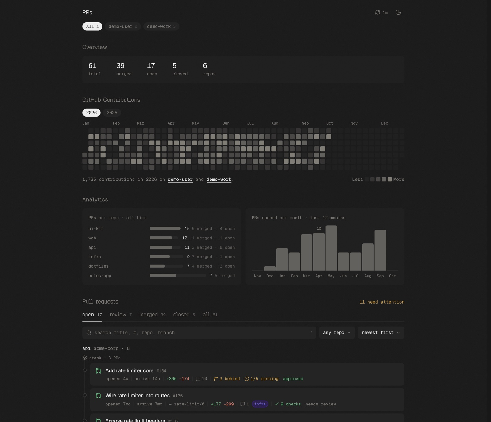

# PR Tracker

One page that shows every pull request you have opened across one or more GitHub accounts, along with the reviews waiting on you and your contribution graph. It runs on a Cloudflare Worker, and you can run it locally with a GitHub token.



## Features

- Open, review, merged, closed, and all tabs, with search and repo filters
- Each PR card shows its age, check results, review state, and whether it is behind its base branch
- Stacked PRs (a PR based on another of your PRs) are drawn as a chain
- GitHub contribution calendar per account, including private activity
- Keyboard shortcuts: `1` all accounts, `2`-`9` a single account, `o` `r` `m` `c` `a` tabs, `/` search, `d` theme

Each card links to the PR on GitHub. The app does not fetch PR bodies, comments, or diffs.

## Requirements

- Node 20+ and [pnpm](https://pnpm.io)
- A GitHub personal access token (classic, `repo` scope) for each account you want to track

## Setup

Clone or fork this repo, then:

```sh
pnpm install
cp .dev.vars.example .dev.vars
```

1. In `wrangler.jsonc`, set `ACCOUNTS` to your GitHub login(s), each paired with the name of the variable that holds its token. For example: `"octocat:GITHUB_TOKEN_1,octocat-work:GITHUB_TOKEN_2"`.
2. In `.dev.vars`, set each token variable. If you use the GitHub CLI, `gh auth token` prints one.

```sh
pnpm dev
```

Open http://localhost:5173.

To try it without a token, put `DEMO=1` in `.dev.vars`. The app then serves generated mock data.

## Environment variables

| Variable | Required | What it is for |
|---|---|---|
| `ACCOUNTS` | Yes | Set in `wrangler.jsonc`. Comma-separated `login:TOKEN_VAR` pairs |
| `GITHUB_TOKEN_1`, `GITHUB_TOKEN_2`, ... | Yes | One token per account. The names just have to match `ACCOUNTS` |
| `APP_PASSWORD` | No | Puts a passphrase page in front of the app. Recommended once deployed, since the data includes private repos |
| `SESSION_VERSION` | No | Change it to log out every session |
| `ACCESS_TEAM`, `ACCESS_AUD` | No | Also require a Cloudflare Access login |
| `DEMO` | No | Set to `1` to serve mock data instead of calling GitHub |

## Deployment

```sh
pnpm exec wrangler login
pnpm exec wrangler kv namespace create CACHE   # paste the id into wrangler.jsonc
pnpm exec wrangler secret put GITHUB_TOKEN_1
pnpm exec wrangler secret put APP_PASSWORD
pnpm deploy
```

A cron job refreshes the data every 10 minutes and caches it in KV, so pages load without waiting on GitHub. To use your own domain, uncomment `routes` in `wrangler.jsonc`.

## Notes

- GitHub search returns at most 1000 PRs per account.
- With no `APP_PASSWORD` set, the page is open to anyone who has the URL.

## License

MIT. See [LICENSE](LICENSE).
